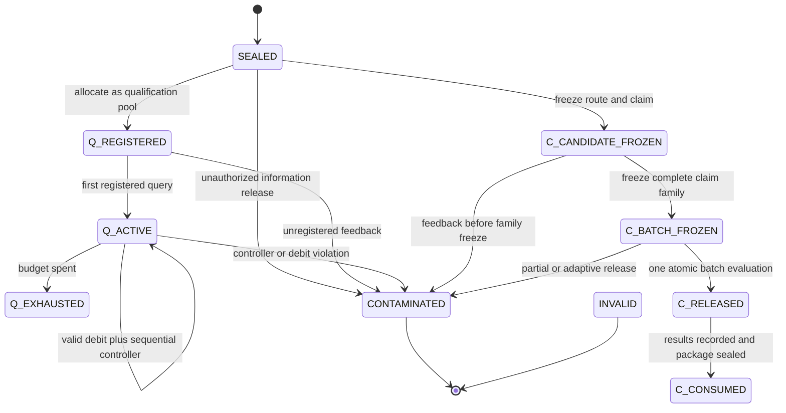

# Protected-evidence state machine

## State definitions

| State | Meaning | Maximum possible authority |
|---|---|---|
| `SEALED` | No outcome-dependent information from the pool has been released. | T3 if all later conditions pass. |
| `Q_REGISTERED` | Pool is registered for qualification access with a frozen broker and budget. | T2. |
| `Q_ACTIVE` | One or more registered qualification queries have released information. | T2 under a valid controller. |
| `Q_EXHAUSTED` | Qualification access budget is spent. | Existing valid T2 only; no more queries. |
| `C_CANDIDATE_FROZEN` | Route and scientific claim are frozen, but the full final family is not yet sealed. | Potential T3. |
| `C_BATCH_FROZEN` | All claims, weights, tests and missingness rules are immutable. | Potential T3. |
| `C_RELEASED` | The single registered final batch has been evaluated and returned. | T3 for passing claims. |
| `C_CONSUMED` | Final evidence has been used; no additional variants may be tested. | Existing T3 only. |
| `CONTAMINATED` | Unauthorized or selection-influencing information was released. | T1/T2 only, depending on other evidence. |
| `INVALID` | Identity, provenance or controller validity cannot be reconstructed. | T0/T1 only. |

## Permitted transitions

There is no transition from `Q_ACTIVE`, `Q_EXHAUSTED`, `C_RELEASED`, `C_CONSUMED`, `CONTAMINATED`, or `INVALID` back to `SEALED` for the same evidence identity and claim family.

## Access ledger fields

Every protected-evidence event records:

- pool identity and content checksum;
- evidence-unit identity map checksum;
- claim-family identifier;
- agent/session/provider identity;
- route and query specification hashes;
- state before and after the event;
- feedback payload class and payload hash;
- controller identifier, current wealth/spend and debit;
- authorization record and timestamp;
- whether any information was released;
- irreversible contamination reason, if applicable.

## Atomic final release

The confirmation broker receives the entire frozen batch and returns results only after evaluating every declared final claim. It must not reveal per-claim progress, ranks, directions, errors correlated with outcomes, or partial results that permit claim substitution.

If operational failure occurs before any outcome-dependent information is released, an identical retry may occur under the frozen retry rule. If any outcome-dependent information was released, the batch is consumed and cannot be retried for confirmatory authority.

## Evidence-budget accounting

The evidence budget is not a monetary or token budget. It is a scientific information-access budget. The primary ledger quantities are:

- `q_queries_total`;
- `q_feedback_payload_class`;
- `q_alpha_spent` or `q_e_wealth_state`;
- `c_claims_in_frozen_batch`;
- `c_familywise_alpha_total`;
- `c_release_count`;
- `independent_evidence_units`;
- `evidence_identity_reuse_count`.

Provider cost, latency and tokens are reported separately and cannot purchase additional scientific authority.

